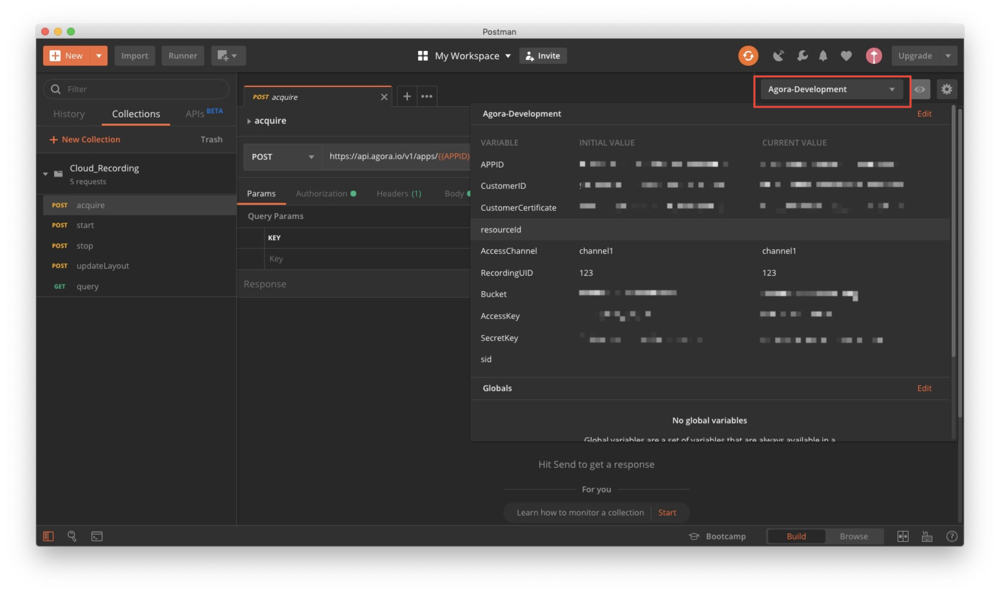
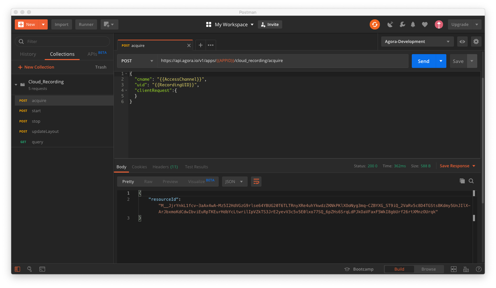

# Agora Cloud Recording Postman Collection

Agora offers a Postman collection, which contains sample RESTful API requests for a cloud recording. You can use the sample requests to:

- Record a live broadcast in composite recording mode
- Configure the video layout or update the layout during recording
- Store the recorded files in the third-party cloud storage that you specify.

To learn more about what you can do with the Cloud Recording RESTful APIs, see [Agora Cloud Recording RESTful API](https://docs.agora.io/en/cloud-recording/cloud_recording_api_rest?platform=All%20Platforms).

# Prerequisites

Complete the following tasks before testing/using the Cloud Recording RESTful APIs. 

- Deploy a third-party cloud storage.

- Enable cloud recording.

- An app that integrates the [Agora RTC SDK](https://docs.agora.io/en/Agora%20Platform/terms?platform=All%20Platforms#rtc-sdk).
- [Install Postman](https://www.getpostman.com/downloads/).

You can find more details in the [Cloud Recording RESTful API Quickstart](https://docs.agora.io/en/cloud-recording/cloud_recording_rest?platform=All%20Platforms).

## Import Postman collection

- Clone the repo.

- Open `Cloud_Recording.postman_environment.json` and enter values for the variables. You can find more details about these variables in [Agora Cloud Recording RESTful API](https://docs.agora.io/en/cloud-recording/cloud_recording_api_rest?platform=All%20Platforms).

  - `APPID`: The [App ID](https://docs.agora.io/en/Agora%20Platform/terms?platform=All%20Platforms#a-nameappidaapp-id) used in the channel that you want to record.
  - `CustomerID`: Find your Customer ID and Customer Certificate on the RESTful API page in [Console](https://console.agora.io/). See [RESTful API authentication](https://docs.agora.io/en/faq/restful_authentication) for details.
  - `CustomerCertificate`: Find your Customer ID and Customer Certificate on the RESTful API page in [Console](https://console.agora.io/). See [RESTful API authentication](https://docs.agora.io/en/faq/restful_authentication) for details.
  - `resourceId`: You do not need to enter any value for this variable. This variable is automatically populated with the response of the `acquire` method.
  - `AccessChannel`: The name of the channel that you want to record.
  - `RecordingUID`: String that contains the UID of the recording client, for example `"527841"`. The UID needs to meet the following requirements:
    - It is a 32-bit unsigned integer within the range of 1 and (232-1).
    - It is unique and does not clash with any existing UID in the channel.
    - It should not be a string. Ensure that all UIDs in the channel are integers.
  - `Vender`: The third-party cloud storage vendor.
  - `Region`: The regional information specified by the third-party cloud storage. When the third-party cloud storage is [Amazon S3](https://aws.amazon.com/s3/?nc1=h_ls) (`vendor` = 1):
      - `0`: US_EAST_1
      - `1`: US_EAST_2
      - `2`: US_WEST_1
      - `3`: US_WEST_2
      - `4`: EU_WEST_1
      - `5`: EU_WEST_2
      - `6`: EU_WEST_3
      - `7`: EU_CENTRAL_1
      - `8`: AP_SOUTHEAST_1
      - `9`: AP_SOUTHEAST_2
      - `10`: AP_NORTHEAST_1
      - `11`: AP_NORTHEAST_2
      - `12`: SA_EAST_1
      - `13`: CA_CENTRAL_1
      - `14`: AP_SOUTH_1
      - `15`: CN_NORTH_1
      - `16`: CN_NORTHWEST_1
      - `17`: US_GOV_WEST_1
  - `Bucket`: The bucket of the third-party cloud storage.
  - `AccessKey`: The access key of the third-party cloud storage.
  - `SecretKey`: The secret key of the third-party cloud storage.
  - `sid`: You do not need to enter any value for this variable. This variable is automatically populated with the response of the `start` method.
- Open Postman and import `Cloud_Recording.postman_collection.json` and `Cloud_Recording.postman_environment.json`.
- Ensure that you select the `Agora-Development` environment.

## Acquire the resource ID

After you set up the environment in Postman and get your live stream running, call `acquire` to get your resource ID. To do so, double-click **acquire** to open the request in a new tab, and click **Send** to send the request. You can find the response of the request in the **Response** section.

## Start and stop a recording

Now that you have your resource ID, you can call `start` to begin a recording and the `stop` method to end it.

> The resource ID is valid for five minutes, so you need to start a recording with this resource ID within five minutes.

You can also call `query` and `updateLayout` in a recording session:

- The `query` method enables you to get the status of the recording.
- The `updateLayout` method enables you to change the layout configuration of the recording in composite recording mode. 

## Play recorded files online

If the media streams are successfully recorded, you can find recorded files in the specified third-party cloud storage and play them online. See [Play Recorded Files Online](https://docs.agora.io/en/cloud-recording/cloud_recording_onlineplay?platform=All%20Platforms) for more information.

